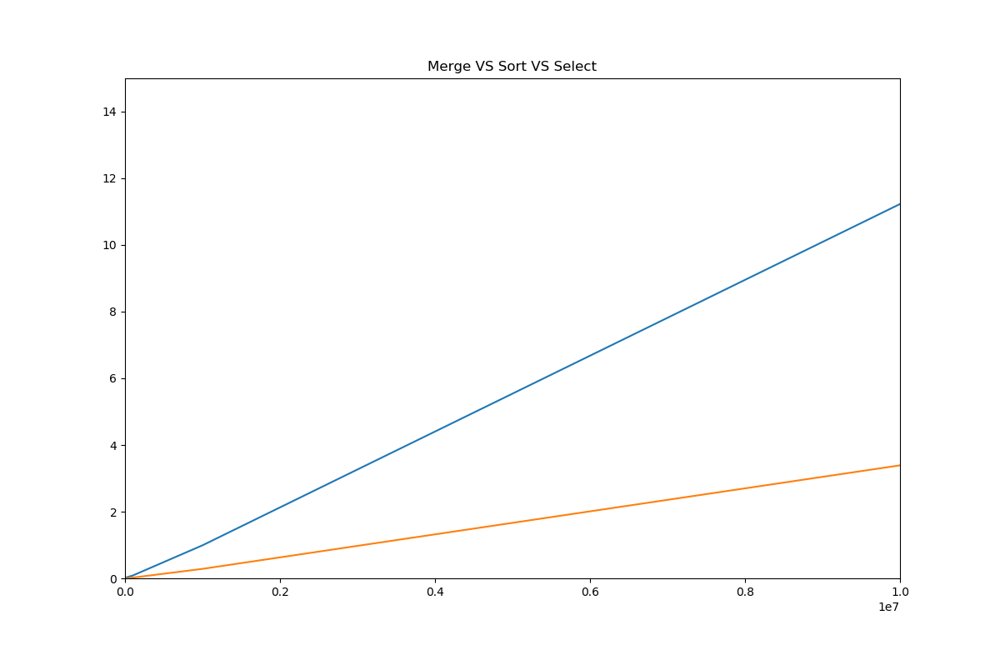
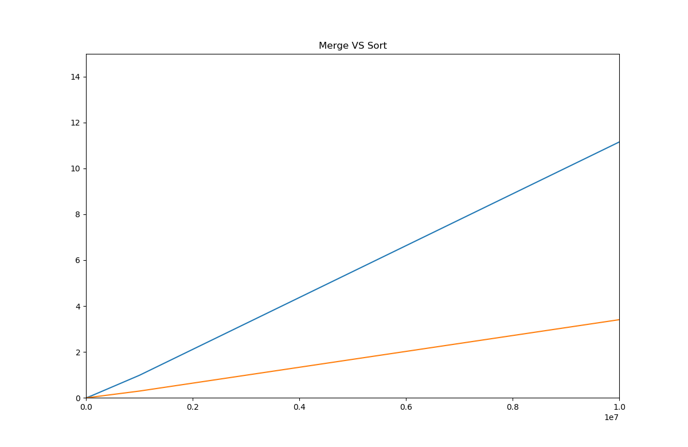
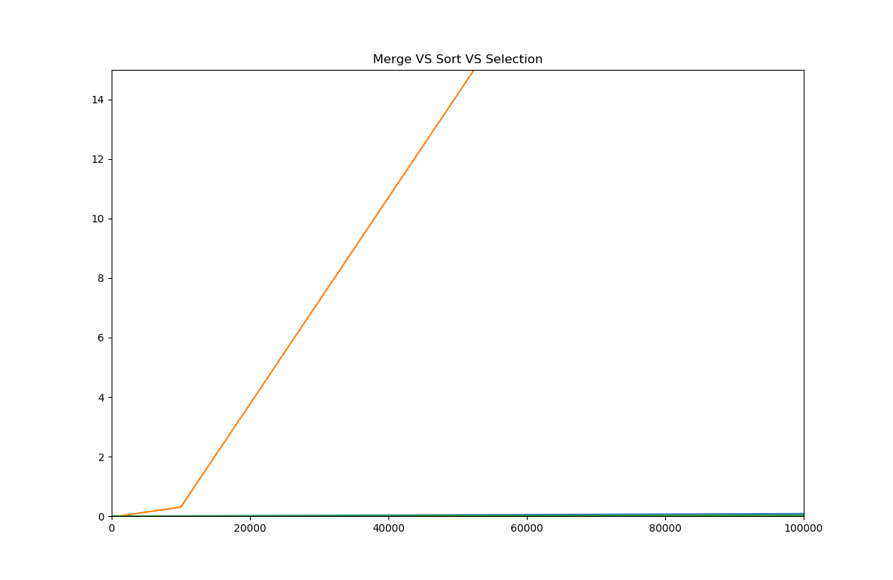
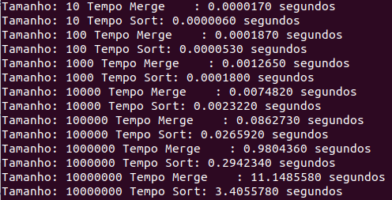
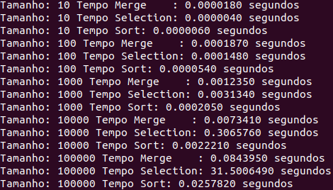

**Número da Lista**: Lista 4
**Conteúdo da Disciplina** Dividir para Conquistar

## Alunos
|Matrícula | Aluno |
| -- | -- |
| 17/0062465  |  Paulo Vitor Coelho da Rocha |
| 15/0023375  |  Vitor Cardoso Xoteslem |

## Sobre 
Nosso projeto se resume a comparar as velocidades de execução entre os algoritmos de ordenação MergeSort, SelectionSort, e Sort implementado no c++.

## Screenshots






Installation
------------
matplotlib-cpp
==============

matplotlib-cpp works by wrapping the popular python plotting library matplotlib. (matplotlib.org)
This means you have to have a working python installation, including development headers.
On Ubuntu:
```
    sudo apt-get install python-matplotlib python-numpy python2.7-dev

    g++ MergeSortCompare.cpp -I/usr/include/python2.7 -lpython2.7

```