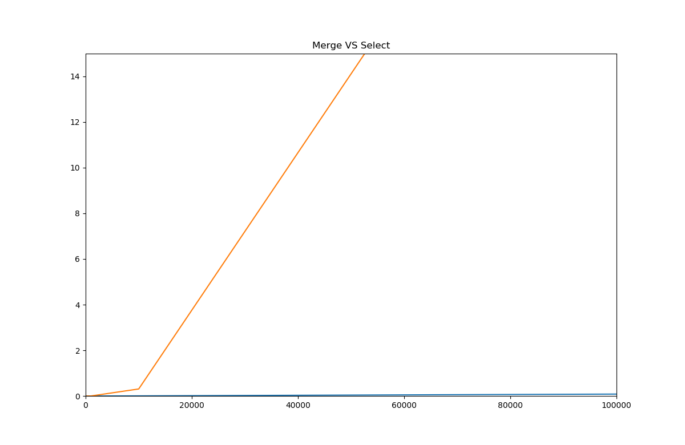

**Número da Lista**: Lista 4

**Conteúdo da Disciplina** Dividir para Conquistar

## Alunos
|Matrícula | Aluno |
| -- | -- |
| 17/0062465  |  Paulo Vitor Coelho da Rocha |
| 15/0023375  |  Vitor Cardoso Xoteslem |

## Sobre 
Nosso projeto se resume a comparar as velocidades de execução entre os algoritmos de ordenação MergeSort, SelectionSort, e Sort implementado no c++ e resolução AC da questao 1520 da plataforma URI. 

## Screenshots



Instalação do comparador
------------

O matplotlib-cpp funciona agrupando a popular biblioteca de plotagem python matplotlib. (matplotlib.org)
Isso significa que você precisa ter uma instalação python funcionando, incluindo cabeçalhos de desenvolvimento.
No Ubuntu:

```
    sudo apt-get install python-matplotlib python-numpy python2.7-dev
    g++ MergeSortCompare.cpp -I/usr/include/python2.7 -lpython2.7
    ./a.out

```
Para rodar a questão 1520 Accepted

```
    g++ DivideAndConquer.cpp
    ./a.out

```
